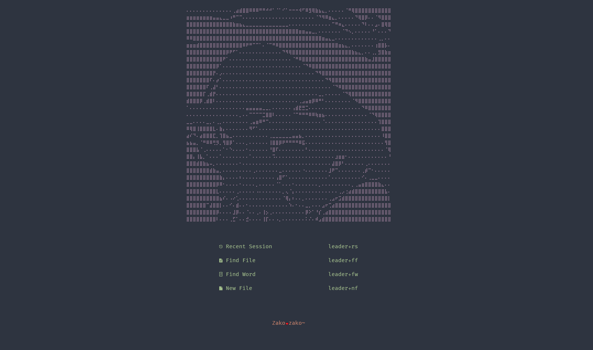
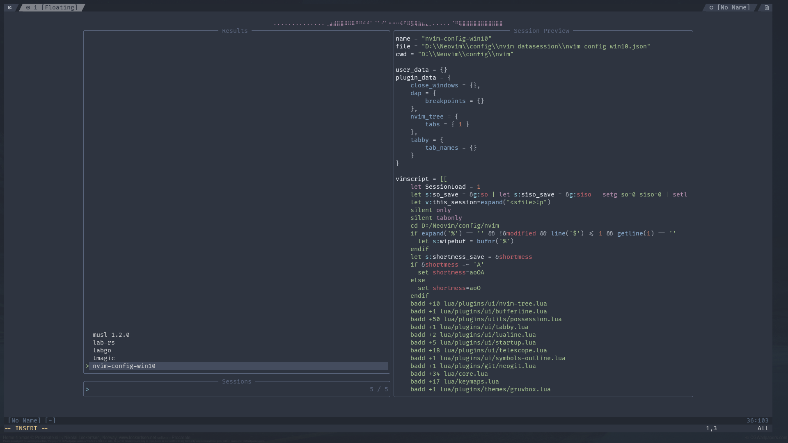
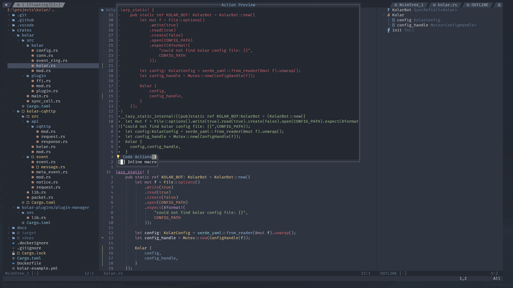
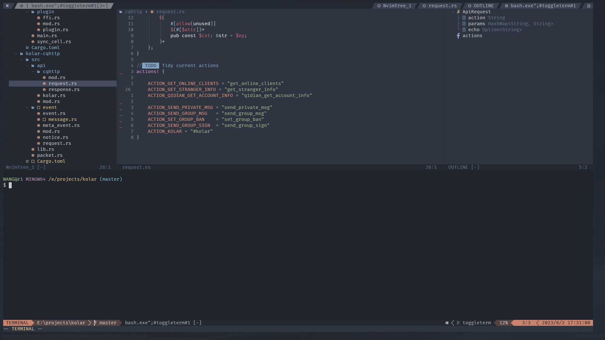
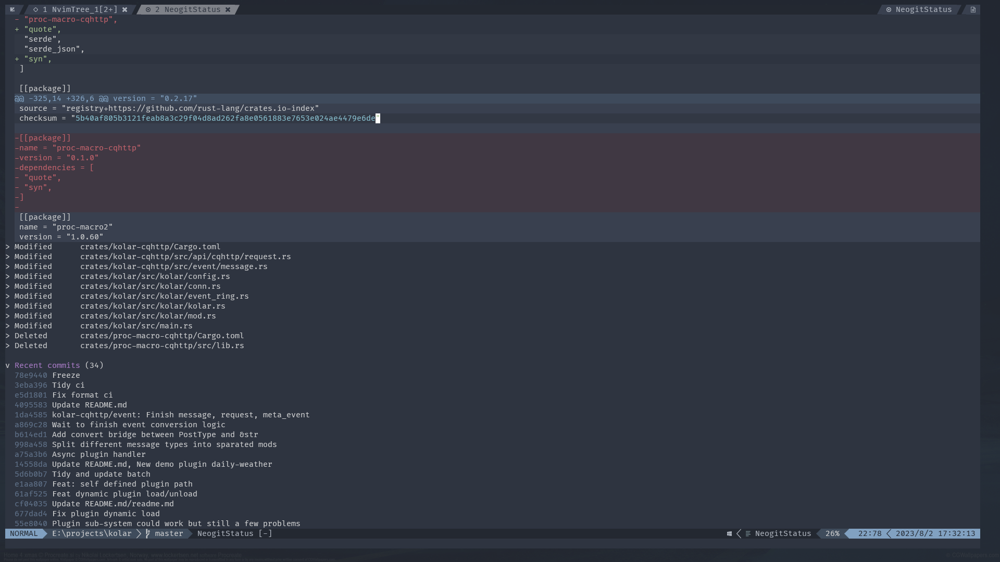
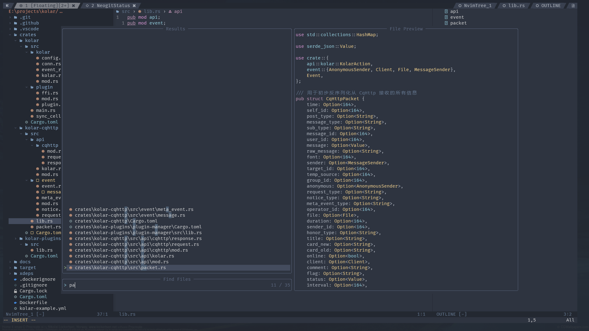
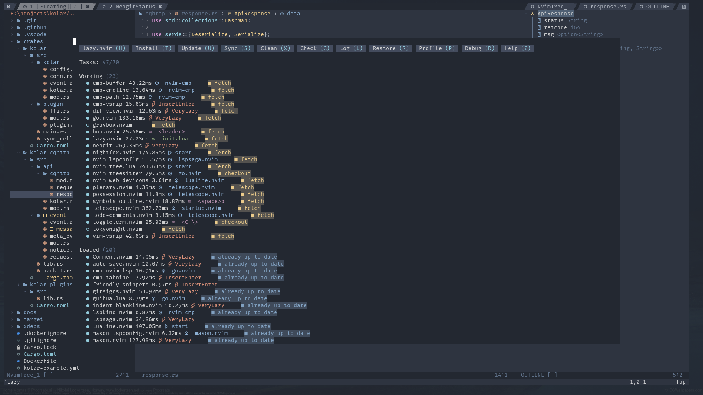

# my-neovim-config

## Preview

### Dashboard(startup.nvim)

### Session(possession.nvim)

### Coding

### Terminal

### Git

### Fuzzy Search(file, rg)

### Plugin Manager(Lazy.nvim)

## Others

OS: Windows10/Ubuntu20.04(WSL2)

Font: FiraCode Nerd Font Mono

Terminal: Git Bash on Windows terminal (Theme: **One Half Dark** theme), Bash

## TODO

- speed up(currently 200ms or so to startup)
- debug support
- ssh
